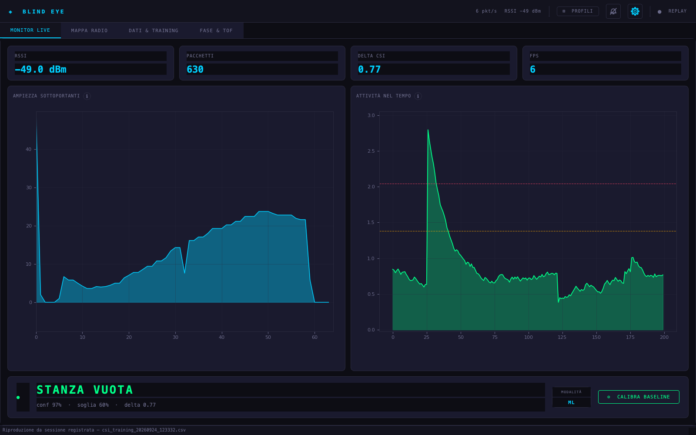
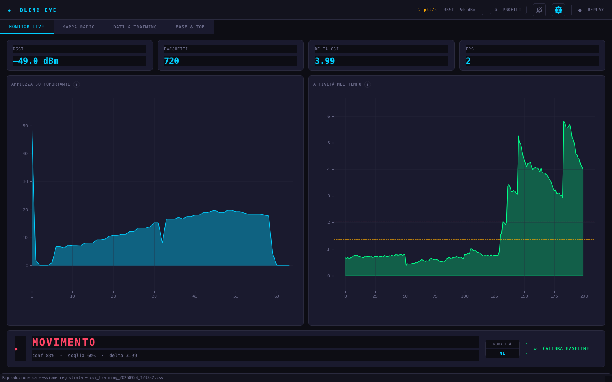
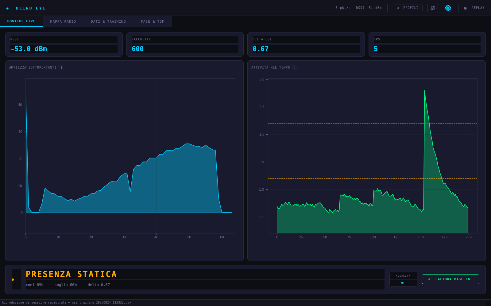
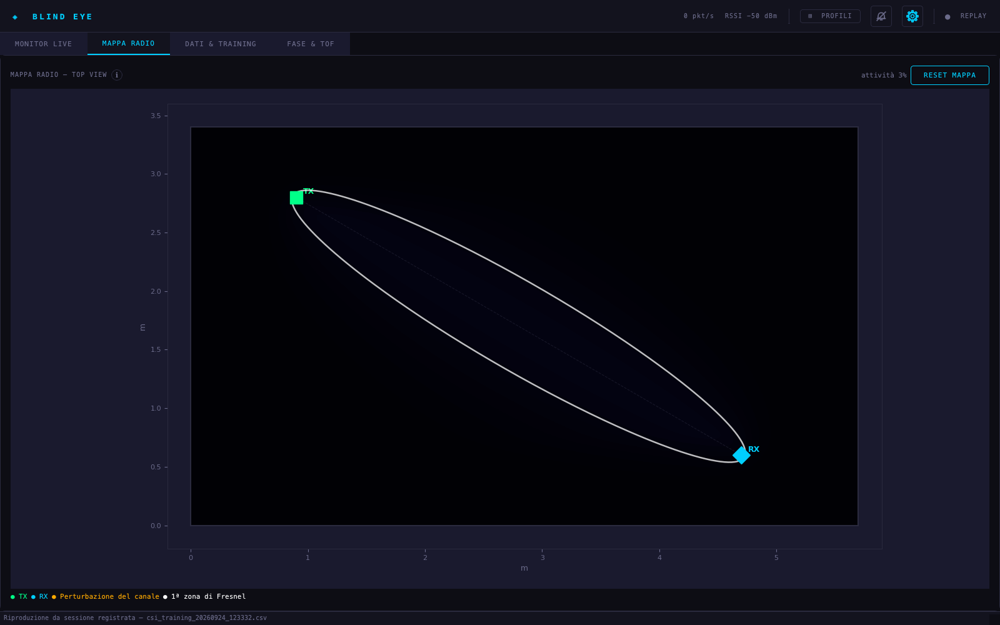

# BlindEyes 👁️

Sistema di rilevamento presenza e movimento **senza telecamere**, basato su Wi-Fi CSI (Channel State Information) e machine learning. Due ESP32 formano un link radio: ogni volta che una persona attraversa o si trova nel campo tra i due dispositivi, le proprietà del canale Wi-Fi cambiano — BlindEyes analizza queste variazioni per classificare lo stato della stanza in tempo reale.

---

## Screenshot

| Stanza vuota | Movimento | Presenza statica |
|---|---|---|
|  |  |  |



Il lobo segue la **prima zona di Fresnel** fra TX e RX (linea bianca): indica
dove il link è sensibile a un ostacolo, non dove si trova la persona. Con una
sola coppia TX–RX non c'è informazione sufficiente per localizzare.

Le altre catture, con le rispettive didascalie, stanno in
[](screenshots/).

## Come funziona

Quando un segnale Wi-Fi viaggia da un punto A a un punto B, rimbalza su pareti, oggetti e persone. Ogni riflessione altera l'**ampiezza** e la **fase** del segnale su ciascuna delle **64 sottoportanti OFDM** (subcarrier). Il firmware ESP-CSI espone questi dati grezzi via seriale: BlindEyes li legge, li processa e li passa a un classificatore **Random Forest** per determinare se la stanza è:

- `empty` — stanza vuota
- `motion` — presenza in movimento
- `static` — presenza ferma

### Feature relative

Il punto delicato è *quali* grandezze dare al classificatore. Usare l'ampiezza
assoluta per sottoportante e il livello RSSI sembra naturale, ma produce un
modello che è di fatto un'impronta digitale della configurazione radio esatta
del giorno del training: basta ruotare un'antenna o un diverso stato dell'AGC
e le predizioni degradano, anche nella stessa stanza.

BlindEyes usa quindi solo grandezze **relative**, invarianti al guadagno:

| Feature | Quante | Cosa cattura |
|---|---|---|
| `shape_i` — ampiezza normalizzata sulla media di riga | 52 | la *forma* dello spettro, non il suo livello |
| `cv_i` — deviazione standard / media sulla finestra | 52 | quanto ogni sottoportante fluttua nel tempo |
| aggregati (`cv_mean`, `cv_max`, `cv_p90`, `shape_drift`, `lvl_ratio`, `corr_half`, `rssi_cv`, `rssi_dev`) | 8 | dinamica complessiva del canale |

Sono 52 sottoportanti e non 64 perché sugli indici 0–5, 32 (la DC) e 59–63
l'ESP32 non riporta dati utili: i primi due sono costanti di intestazione della
trama, gli altri sono bande di guardia sempre a zero. Tenerli dentro non è
neutro — essendo costanti, la loro ampiezza normalizzata vale
`costante / media(riga)` e reintroduce di nascosto la dipendenza dal livello
assoluto che le feature relative servono proprio a eliminare.

La fase grezza non viene usata: sull'ESP32 è dominata dal carrier frequency
offset, non dalla propagazione.

---

## Hardware necessario

| Componente | Quantità | Note |
|---|---|---|
| ESP32-C6 o ESP32-C5 | 2 | Consigliati per la qualità RF. Funzionano anche C3/S3/S2 |
| Antenna esterna | 2 | L'antenna PCB integrata è sconsigliata — interferisce con la scheda |
| Cavo USB | 1 | Per collegare il RX al computer (solo un cavo serve) |

I due ESP32 devono essere posizionati a **più di 1 metro di distanza** l'uno dall'altro, idealmente su lati opposti della stanza da monitorare.

---

## Firmware ESP-CSI

Il firmware è open source, fornito da Espressif. Va compilato con **ESP-IDF** e flashato separatamente sui due dispositivi.

### 1. Clona il repository del firmware

```bash
git clone https://github.com/espressif/esp-csi.git
cd esp-csi
```

### 2. Installa ESP-IDF (se non già presente)

Segui la guida ufficiale: https://docs.espressif.com/projects/esp-idf/en/latest/esp32/get-started/

### 3. Flasha il firmware TX (trasmettitore)

Il TX invia pacchetti ESP-NOW continuamente. Non è collegato al computer durante il funzionamento normale.

```bash
cd esp-csi/examples/get-started/csi_send
idf.py set-target esp32c6      # o esp32c5 / esp32c3 in base al tuo modello
idf.py flash -b 921600 -p /dev/ttyUSB0 monitor
```

Il MAC address del TX verrà stampato nel monitor seriale — annotalo, ti servirà nelle impostazioni di BlindEyes.

> Su ESP32-C6/C5 il MAC di default è `1a:00:00:00:00:00`. Verificalo dal monitor seriale.

### 4. Flasha il firmware RX (ricevitore)

Il RX riceve i pacchetti del TX, misura il CSI e invia i dati grezzi via USB al computer.

```bash
cd esp-csi/examples/get-started/csi_recv
idf.py set-target esp32c6      # deve corrispondere al modello usato
idf.py flash -b 921600 -p /dev/ttyUSB1
```

Dopo il flash, **lascia il RX collegato via USB** al Mac — è l'unico collegamento necessario durante il funzionamento.

---

## Installazione di BlindEyes

### Dipendenze Python

Richiede **Python 3.11** (consigliato via Homebrew su macOS).

```bash
pip install PyQt6 numpy matplotlib scikit-learn joblib pyserial
```

### Avvio

```bash
cd "Blind eyes.py"
python3.11 dashboard.py
```

Oppure usa direttamente l'app bundle **`Blind Eye.app`** trascinandola in `/Applications`.

---

## Configurazione iniziale

Al primo avvio apri le **Impostazioni** (icona ⚙ in alto a destra) e configura:

| Parametro | Descrizione |
|---|---|
| **Porta seriale** | La porta USB del RX, es. `/dev/cu.usbserial-110` |
| **Baud rate** | `115200` (default, non cambiare) |
| **MAC address TX** | Il MAC del dispositivo trasmettitore, es. `1a:00:00:00:00:00` |
| **Dimensioni stanza** | Larghezza e altezza in metri |
| **Posizione TX / RX** | Coordinate X, Y in metri nella stanza |
| **Soglia confidenza** | Soglia minima per accettare una predizione (default: 0.60) |

---

## Training del modello

Il modello **non è incluso nel repository** e non avrebbe senso che lo fosse:
è la firma radio di una stanza specifica, con TX e RX in posizioni precise.
Va addestrato in loco, e sono circa 6 minuti.

### Procedura guidata

1. Vai nella tab **DATI & TRAINING**
2. Premi **AVVIA SEQUENZA** — il programma guida attraverso 3 fasi da 120 secondi ciascuna:
   - **Fase 1 — Stanza vuota**: esci dalla stanza per 2 minuti
   - **Fase 2 — Movimento**: cammina avanti e indietro tra TX e RX, variando velocità e traiettoria
   - **Fase 3 — Presenza statica**: spostati in vari punti della stanza, fermandoti ~30 secondi per posizione
3. Al termine premi **SALVA TRAINING CSV** per un backup
4. Premi **ADDESTRA MODELLO** — in pochi secondi viene mostrata l'accuracy

Il pulsante **CARICA CSV** rilegge una o più sessioni salvate in precedenza e
le rende addestrabili: serve perché `ADDESTRA MODELLO` lavora sui dati in
memoria, quindi senza ricaricare il CSV il lavoro di raccolta andrebbe perso
alla chiusura dell'app. Selezionando più file vengono uniti; se un dataset è
già in memoria l'app chiede se aggiungere o sostituire.

### Aggiungere posizioni statiche

La presenza statica è una firma che **dipende dal punto in cui si sta fermi**:
il modello riconosce bene le posizioni che ha visto durante il training e
fatica su quelle nuove. Se accade che restando fermo in certi punti della
stanza l'app dica `stanza vuota`, la cura è coprire più punti — non cambiare
il modello.

Il pulsante **+ AGGIUNGI CAMPIONI** registra campioni extra per una singola
classe e li accoda al dataset in memoria, senza rifare i 6 minuti della
sequenza completa. Scegli `static`, una durata, e mettiti in un punto nuovo.

Il costo va conosciuto. Misurato aggiungendo posizioni alla sessione di
riferimento:

| Posizioni statiche | `empty` | `motion` | `static` |
|---|---|---|---|
| 1 | 91.9% | 97.2% | 96.2% |
| 2 | 90.9% | 97.3% | 92.2% |
| 3 | 89.2% | 97.4% | 86.3% |
| 4 | 88.4% | 97.1% | 89.5% |

`motion` è indifferente: resta a ~97% qualunque cosa si aggiunga. `empty`
perde circa **un punto per posizione aggiunta**, perché la classe `static`
diventa più eterogenea e si avvicina alla stanza vuota. È un compromesso
reale: due posizioni in più costano ~2 punti di `empty` e in cambio la
presenza statica viene riconosciuta dove prima no.

Il calo di `static` nella tabella non è un peggioramento: con più posizioni la
classe è più varia, quindi il richiamo misurato su blocchi temporali tenuti
fuori scende anche mentre la copertura dei punti reali della stanza migliora.

### Accuracy attesa

### Come viene misurata l'accuracy

Le finestre consecutive si sovrappongono quasi completamente, quindi sono
fortemente correlate. Una cross-validation casuale ne metterebbe una in train e
la sua quasi-gemella in test, restituendo un numero privo di significato. Qui
i fold sono **blocchi temporali contigui dentro ogni classe**, con un
**embargo** che esclude dal training i campioni entro una finestra dal blocco
di test.

Quanto conta la differenza, sulla stessa identica sessione da ~3200 campioni:

| Come si misura | Risultato |
|---|---|
| Accuracy sul training set | 99.8% |
| CV casuale 5-fold | 99.2% |
| Fold a blocchi, senza embargo | 86.5% |
| **Fold a blocchi + embargo** | **84.4%** |

Gli ultimi due numeri descrivono la stessa identica sessione: la differenza è
solo quanta informazione il test set condivide con il training. L'84.4% è il
solo onesto.

### Finestre in secondi, non in pacchetti

L'ESP32 su questo setup trasmette a **~8.8 pacchetti/s**, non ai ~100 Hz che
verrebbe naturale assumere. È una differenza sostanziale: con le finestre
espresse in numero di pacchetti, una finestra "da 32" copre 3.6 secondi e la
media delle probabilità "da 48" ne copre 5.5. A quelle scale il fatto di
camminare e quello di fermarsi finiscono nella stessa media, l'uscita resta
permanentemente a metà fra due classi e quindi sotto la soglia di confidenza:
in pratica l'app mostra `INCERTO` quasi sempre.

Le finestre sono quindi definite in **secondi** e il comportamento non cambia
se il firmware trasmette a un rate diverso:

| Parametro | Valore |
|---|---|
| Finestra feature | 0.9 s |
| Media delle probabilità | 1.8 s |
| Dwell filter | 0.7 s |

Quanto conta, a parità di tutto il resto:

| Finestra feature | Copertura | Accuratezza |
|---|---|---|
| 3.6 s | 87.6% | 88.4% |
| 2.7 s | 89.3% | 89.5% |
| **0.9 s** | **89.9%** | **95.0%** |

### Cosa si vede a schermo

Quello che conta in uso reale non è l'accuracy per finestra ma due cose
insieme: quanto spesso l'app dice qualcosa invece di `INCERTO` (copertura) e
quanto spesso ha ragione quando lo dice. Su dati mai visti dal modello, con
soglia 0.60:

| Classe | Mostra un'etichetta | Ed è corretta |
|---|---|---|
| `motion` | 97.8% del tempo | **100.0%** |
| `empty` | 95.0% del tempo | 91.2% |
| `static` | 86.2% del tempo | 96.7% |

La lettura è quella giusta: i due casi evidenti — stanza vuota, persona che
cammina fra le due radio — vengono riconosciuti quasi sempre e quasi sempre
correttamente. L'incertezza residua si concentra dove è legittima, cioè sulla
presenza immobile.

### Pulizia delle etichette

La fase ③ della sequenza guidata chiede di **cambiare posizione ogni ~30
secondi**. Durante quegli spostamenti la persona cammina, ma l'etichetta
registrata dice ancora `static`. Sono etichette sbagliate, non esempi
difficili: insegnano al modello che camminare può essere presenza ferma, ed è
il motivo per cui in uso reale il movimento veniva spesso classificato come
`static`.

Il fenomeno è visibile nei dati. Tracciando l'attività di canale (`cv_mean`)
lungo i 120 secondi della fase statica compaiono picchi regolari che coincidono
con i cambi di posizione, e il **12.3%** della fase supera la mediana della
fase `motion`.

Individuarli con la sola attività di canale però non funziona, ed è un errore
istruttivo. **Stando fermi molto vicino a una delle due antenne** il segnale è
così accoppiato che il solo respirare produce una variabilità pari a quella
del camminare. Una regola basata sull'attività scarta proprio quei campioni —
cioè la posizione meglio accoppiata della stanza — e insegna al modello che
quella condizione è *stanza vuota*. Misurato: dei campioni scartati in quella
posizione, l'84% veniva poi classificato `empty`.

La differenza vera tra le due situazioni non è quanta attività c'è, ma se la
**forma** dello spettro si sposta: chi cammina attraversa la stanza e la forma
deriva progressivamente; chi respira stando fermo oscilla attorno a una forma
stabile. E uno spostamento dura secondi, un respiro no.

La regola scarta quindi solo le **raffiche sostenute**: sequenze contigue di
almeno 1.5 s in cui *sia* l'attività *sia* la deriva della forma superano il
10° percentile di `motion`. Le soglie vengono dai dati della sessione, e una
raffica si interrompe su un salto temporale, così registrazioni separate non
vengono unite. Sulla sessione di riferimento sono 56 campioni, non 204.

L'effetto, misurato tenendo **completamente fuori dal training** la posizione
più accoppiata e poi testandola tutta — cioè simulando esattamente "mi metto
fermo in un punto che il modello non ha mai visto":

| Regola di pulizia | Posizione mai vista | `empty` | `motion` | `static` |
|---|---|---|---|---|
| nessuna | 91.6% | 88.9% | 95.7% | 83.6% |
| solo attività alta | **72.9%** | 88.4% | 97.1% | 89.5% |
| **raffiche sostenute** | **87.0%** | 89.0% | 96.3% | 87.6% |

Il dialog dei risultati riporta quanti campioni sono stati scartati: un numero
molto alto è il sintomo che la regola sta mangiando dati buoni.

### La soglia di confidenza

La soglia si applica a probabilità **mediate su 1.8 s**, che sono
strutturalmente più basse dei picchi istantanei. Alzarla non rende il sistema
più preciso, lo rende muto:

| Soglia | Copertura | Accuratezza | Copertura su `static` |
|---|---|---|---|
| 0.50 | 97.8% | 93.2% | 96.2% |
| **0.60 (default)** | **89.9%** | **95.0%** | 78.1% |
| 0.70 | 78.9% | 96.9% | 57.6% |
| 0.79 | 66.1% | 98.5% | 39.2% |
| 0.85 | 53.2% | 99.5% | 26.8% |

È un limite di fondo, non un difetto di taratura: riconoscere una persona
*immobile* richiede per forza un confronto con la firma della stanza vuota,
quindi quella distinzione resta legata all'ambiente e va ricalibrata ogni
tanto. Il movimento invece generalizza bene.

---

## Struttura del progetto

```
Blind eyes.py/
├── dashboard.py          # Applicazione principale (PyQt6)
├── csi_model.pkl         # Random Forest addestrato      ─┐ generati dal
├── csi_scaler.pkl        # StandardScaler                 ├─ training, non
├── csi_features.json     # Le 112 feature (52+52+8)      ─┘ versionati
└── settings.json         # Configurazione utente

Blind Eye.app/            # App bundle macOS
```

---

## Pipeline tecnica

```
ESP32 TX  ──[ESP-NOW]──►  ESP32 RX  ──[USB 115200]──►  BlindEyes
                                                            │
                                                  parsing trama CSI
                                                            │
                                            finestra di 0.9 s
                                                            │
                                     52 shape + 52 cv + 8 aggregati
                                          (112 feature, relative)
                                                            │
                                                  StandardScaler
                                                            │
                                              Random Forest (200 alberi)
                                                            │
                                  media probabilità 1.8 s + dwell 0.7 s
                                                            │
                                          empty / motion / static
```

---

## Note di implementazione

Alcune scelte non ovvie, tutte nate da problemi osservati:

**Le finestre sono misurate in secondi, non in pacchetti.** Il rate dell'ESP32
qui è ~8.8 pkt/s, non i ~100 Hz che verrebbe naturale assumere; costanti
espresse in numero di pacchetti producevano finestre da 3–5 secondi.

**L'istante di arrivo viene registrato nel worker seriale**, non quando la coda
viene svuotata. Le finestre sono a tempo: se l'interfaccia è sotto carico più
pacchetti vengono processati nello stesso ciclo, e marcarli tutti con l'ora di
quel momento li farebbe sembrare simultanei, accorciando la finestra proprio
quando serve stabilità.

**Il ritorno dal thread di training passa da un segnale Qt.** Un `QTimer`
creato dentro un `threading.Thread` appartiene a un thread privo di event loop
e non scatta mai: il modello veniva addestrato e salvato, ma la finestra dei
risultati non compariva e il pulsante restava bloccato.

**L'analisi di fase usa il solo blocco LLTF.** La trama dell'ESP32 contiene più
blocchi da 64 sottoportanti con riferimenti di fase indipendenti: srotolarli e
fittarli come una serie unica produceva un gradino artificiale al confine fra
blocchi e una stima del ritardo priva di senso.

**Le icone dell'intestazione sono disegnate, non caratteri.** Il font
dell'interfaccia è monospace e non contiene né il campanello né diversi altri
simboli: venivano renderizzati come quadratini vuoti.

**La mappa usa proporzioni reali** (`aspect='equal'`). Con lo stiramento
automatico la zona di Fresnel — che per un link di 4.4 m è lunga e larga 0.74 m
— sembrava un ellissone che copriva la stanza.

**La normalizzazione dell'attività non si affida solo alla deviazione standard
della baseline.** In una stanza davvero ferma quella deviazione è minuscola,
quindi "3 sigma" diventa una soglia bassissima e qualunque presenza satura la
mappa a fondo scala.

**I limiti degli assi si muovono lentamente e ignorano gli sprazzi.**
Matplotlib riscala su ogni frame: con dati che cambiano dieci volte al secondo
i grafici "ballano" anche a segnale fermo, perché è il riferimento a muoversi.
I limiti si basano sui percentili 0.5–99.5 e si spostano di una frazione per
volta; per la stima di τ, che è rumore per natura, ancora più lentamente.

**La differenza di fase fra frame è riportata in [−π, π].** È definita solo a
meno di un giro: calcolata su due srotolamenti indipendenti saltava di 2π e
faceva esplodere la scala del grafico.

**La finestra delle feature non scende sotto 6 campioni.** Sono deviazioni
standard e correlazioni: stimarle su 3–4 campioni le rende rumorose. Se il rate
cala la finestra si allunga nel tempo invece di svuotarsi, e l'intestazione
segnala in ambra quando si va sotto i 5 pkt/s. A rate nominale la finestra ne
contiene già ~8, quindi il limite non interviene e i vettori feature sono
identici bit per bit.

**I titoli dei tab raddoppiano la `&`.** Qt la interpreta come acceleratore da
tastiera: `DATI & TRAINING` veniva mostrato come `DATI _TRAINING`.

**Il contatore pkt/s viene azzerato da un solo timer.** Erano due, e si
rubavano i pacchetti a vicenda mostrando entrambi valori più bassi del reale.

**La heatmap dei dati normalizza ogni frame sulla propria media.** Senza, le
oscillazioni di livello complessivo dominano e la mappa diventa un pettine di
righe verticali.

## Risoluzione problemi comuni

**Nessuna connessione seriale**
Verifica che il RX sia collegato via USB e che la porta in Impostazioni corrisponda a quella mostrata in `ls /dev/cu.usbserial-*`.

**ESP-NOW send error (no memory)**
Il canale Wi-Fi è congestionato. Cambia canale nel firmware o spostati in un ambiente con meno interferenze.

**Accuracy bassa dopo training**
Assicurati che durante la fase "presenza statica" tu cambi effettivamente posizione nella stanza ogni 30 secondi — non basta cambiare postura.

**Il badge dice EURISTICA invece di ML**
Il modello salvato non corrisponde al set di feature corrente e viene rifiutato
di proposito invece di essere usato a vuoto: la barra di stato ne riporta il
motivo. Rifai il training dal tab DATI & TRAINING.

**Mostra quasi sempre INCERTO**
Controlla la soglia di confidenza nelle Impostazioni: si applica a probabilità
mediate, quindi valori sopra 0.70 rendono l'app muta senza renderla più
precisa. Il default 0.60 copre circa il 90% del tempo.

**Confusione tra stanza vuota e presenza statica**
Rifai la calibrazione dal tab MONITOR LIVE. La baseline è il riferimento
rispetto a cui viene misurato il delta, e senza di essa quella distinzione
è la prima a degradare.

---

## Crediti firmware

Il firmware ESP-CSI è sviluppato da **Espressif Systems**: https://github.com/espressif/esp-csi

---

## Licenza

[MIT](LICENSE) — puoi usare, modificare e ridistribuire questo codice, anche
in progetti commerciali, mantenendo l'avviso di copyright.

La licenza copre la dashboard. Il firmware **ESP-CSI** è di Espressif Systems
ed è distribuito con la propria licenza.

